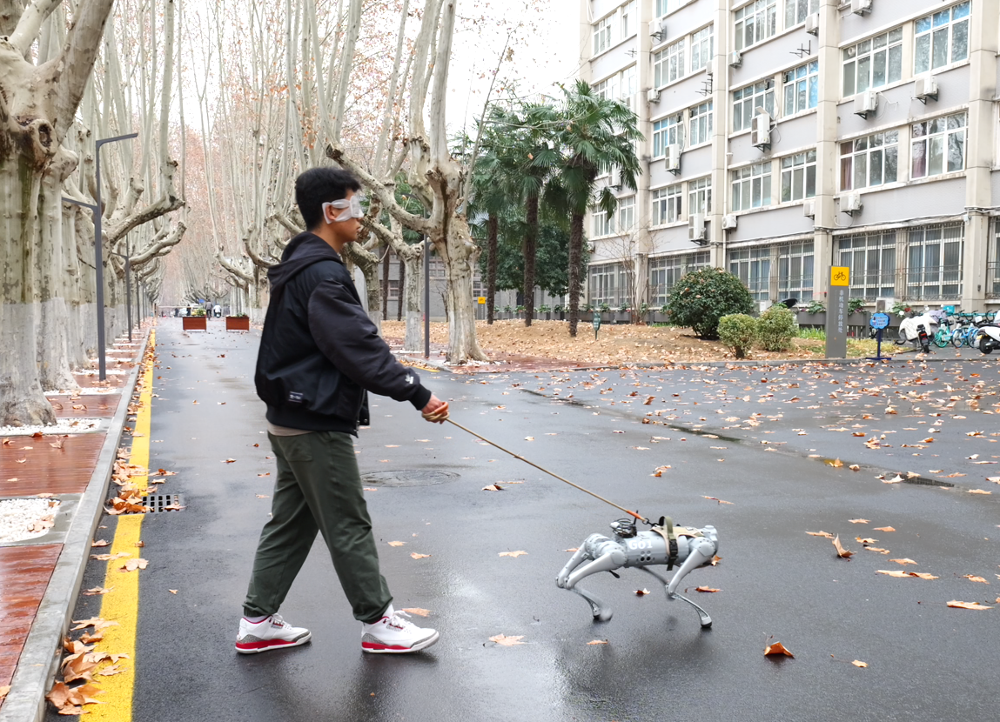
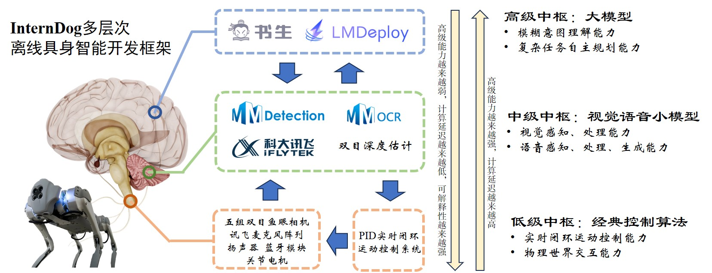
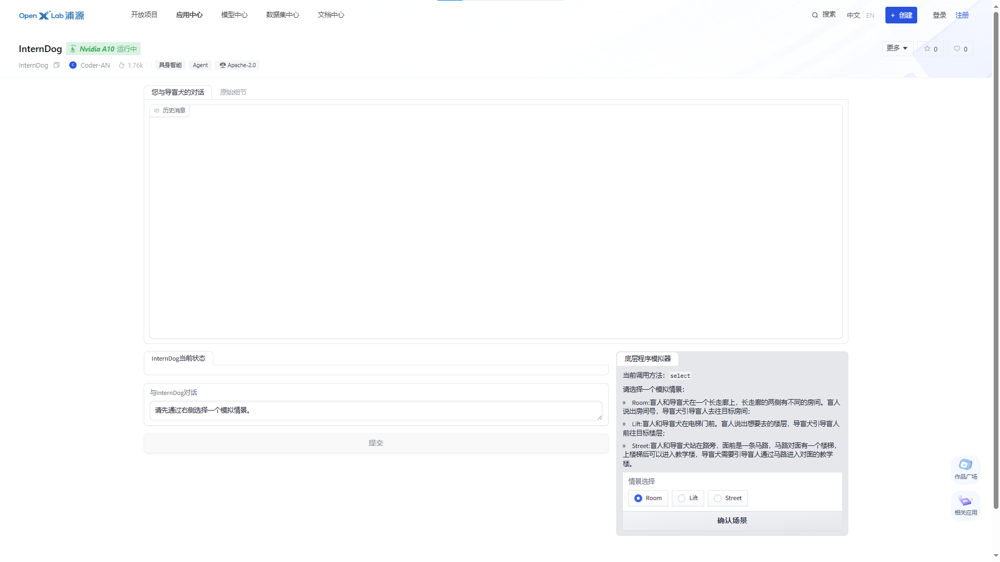
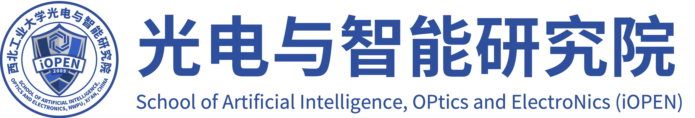

# InternDog: 基于InternLM2大模型的离线具身智能导盲犬

<div align="center"></div>

代码仓库：[[GitHub]](https://github.com/BestAnHongjun/InternDog)

模型仓库：[[ModelScope]](https://modelscope.cn/models/CoderAN/InternDog-w4a16-turbomind/summary)  [[OpenXLab]](https://openxlab.org.cn/models/detail/Coder-AN/InternDog-w4a16-turbomind)

演示视频：[[BiliBili]](https://www.bilibili.com/video/BV1RK421s7dm/)

在线体验Demo：[[OpenXLab]](https://openxlab.org.cn/apps/detail/Coder-AN/InternDog)

## 背景
视障人士在日常生活中面临着诸多挑战，其中包括导航困难、安全隐患等。导盲犬的出现可以为他们提供更为便捷、安全的导航方式，有效改善其生活质量。然而，培养一只合格的导盲犬需要花费大量的时间。从幼犬的筛选、基础训练到专业技能的掌握，每一个阶段都需要有专业的训练师、场地和设备以及大量的时间和成本投入，培养一只传统导盲犬的成本可能高达20万元以上。

四足机器人技术的快速发展使得机器狗代替传统导盲犬成为可能。机器狗导盲犬通过先进的传感器和算法，可以精确感知周围环境并做出智能决策，不受天气、时间或疲劳的限制。它们可以适应各种复杂环境，包括室内、室外、拥挤的城市街道等。开发一套程序可以以近乎零成本的方式迁移到无数台机器狗，使得机器导盲犬的成本相比传统导盲犬大大降低。为此，本团队结合大语言模型技术，开发了一只基于InternLM2大模型的离线具身智能导盲犬。

## 演示视频

<iframe src="//player.bilibili.com/player.html?aid=1701632325&bvid=BV1RK421s7dm&cid=1469102997&p=1" scrolling="no" border="0" frameborder="no" framespacing="0" allowfullscreen="true"> </iframe>

## 简介

InternDog使用情景模拟器生成的情景数据作为微调数据集，使用[Xtuner](https://github.com/InternLM/xtuner)工具基于[InternLM2-Chat-1.8B-SFT](https://modelscope.cn/models/Shanghai_AI_Laboratory/internlm2-chat-1_8b-sft/summary)模型进行微调，然后使用本团队开发的[LMDeploy-Jetson](https://github.com/BestAnHongjun/LMDeploy-Jetson)工具对模型进行W4A16量化，在宇树Go1机器狗板载NVIDIA Jetson Xavier NX (8G)上离线部署。

> LMDeploy-Jetson: [LMDeploy](https://github.com/InternLM/lmdeploy)在Jetson系列板卡上的移植版本。



基于Function Calling机制，本团队提出了“**多层次离线具身智能开发框架**”。主要原因在于：
* 大模型虽然具备较强的模糊意图理解能力以及复杂任务的自主规划能力，但受算力限制，推理速度较慢，不适用于对控制周期较短的实时控制任务。
* 小模型推理速度较快，但是对输入输出有严格的要求，不具备模糊意图识别能力以及复杂任务的规划能力。

因此我们结合大模型和小模型各自的优势，类比哺乳类动物神经系统的分层结构，与底层硬件传感器以及实时闭环运动控制系统将工程整体架构划分为三个层次，各自侧重不同的工作：

* **高级中枢**：推理速度相对较慢，因此主要负责对时效性要求不高但对模糊意图理解能力要求较强的工作，如人机自然语言交互、复杂任务规划等；
* **中级中枢**：推理速度适中，基于YOLO系列目标检测算法、OCR算法对场景进行视觉感知，基于科大讯飞语音模块内置的模型进行离线语音识别、语音合成等任务；
* **低级中枢**：传感器数据接收、控制电机等硬件实时运动等。

其中，“中级中枢”和“低级中枢”统称为“**底层控制程序**”。

## 体验Demo

由于我们的项目涉及真实场景，对于没有机器狗实物的研究者很难复现全部内容验证项目的真实性。为此，我们模拟真实场景，基于OpenXlab平台和Gradio工具制作了一个场景模拟器，由用户来模拟底层控制程序做出相应反应，从而测试大模型的真实表现。

**在线体验地址**：[OpenXlab](https://openxlab.org.cn/apps/detail/Coder-AN/InternDog)



**本地体验方法**(8G显存以上NVIDIA GPU)：

```sh
# 克隆仓库
git clone https://github.com/BestAnHongjun/InternDog.git

# 进入项目目录
cd InternDog

# 安装依赖
pip install -r requirements.txt

# 运行网页版demo
python app.py

# 运行终端demo
python app_cli.py
```

## 使用教程

### 1.训练数据生成

使用本项目开发的场景模拟器生成训练数据。

```sh
cd data
python gen_all_data.py
```

### 2.模型微调

安装依赖项。

```sh
pip install -r requirements_all.txt
```

下载[InternLM2-Chat-1.8B-SFT](https://modelscope.cn/models/Shanghai_AI_Laboratory/internlm2-chat-1_8b-sft/summary)大模型。

```sh
python python fine-tune/download_pretrain_model.py 
```

基于xtuner微调模型。

```sh
xtuner train ./fine-tune/internlm2_1_8b_qlora_lift_e3.py --deepspeed deepspeed_zero2
```

生成Adapter。

```sh
# 注意修改.sh文件第六行模型文件路径
./tools/1.convert_model.sh
```

合并Adapter。

```sh
# 注意修改模型路径
./tools/2.merge_model.sh
```

### 3.模型量化

W4A16量化模型。

```sh
# 注意修改模型路径
./tools/3.quantize_model.sh
```

转化为TurboMind模型。

```sh
# 注意修改模型路径
./tools/4.turbomind_model.sh
```

### 4.模型部署

请参考社区项目[LMDeploy-Jetson](https://github.com/BestAnHongjun/LMDeploy-Jetson)在Jetson板卡部署模型。

## 开发团队

团队成员：[安泓郡](https://www.anhongjun.top)，肖建功，赵昊飞

导师：[孙哲](https://iopen.nwpu.edu.cn/info/1251/2076.htm), [李学龙](https://iopen.nwpu.edu.cn/info/1015/1172.htm)

单位：西北工业大学光电与智能研究院

<div align="center"></div>
